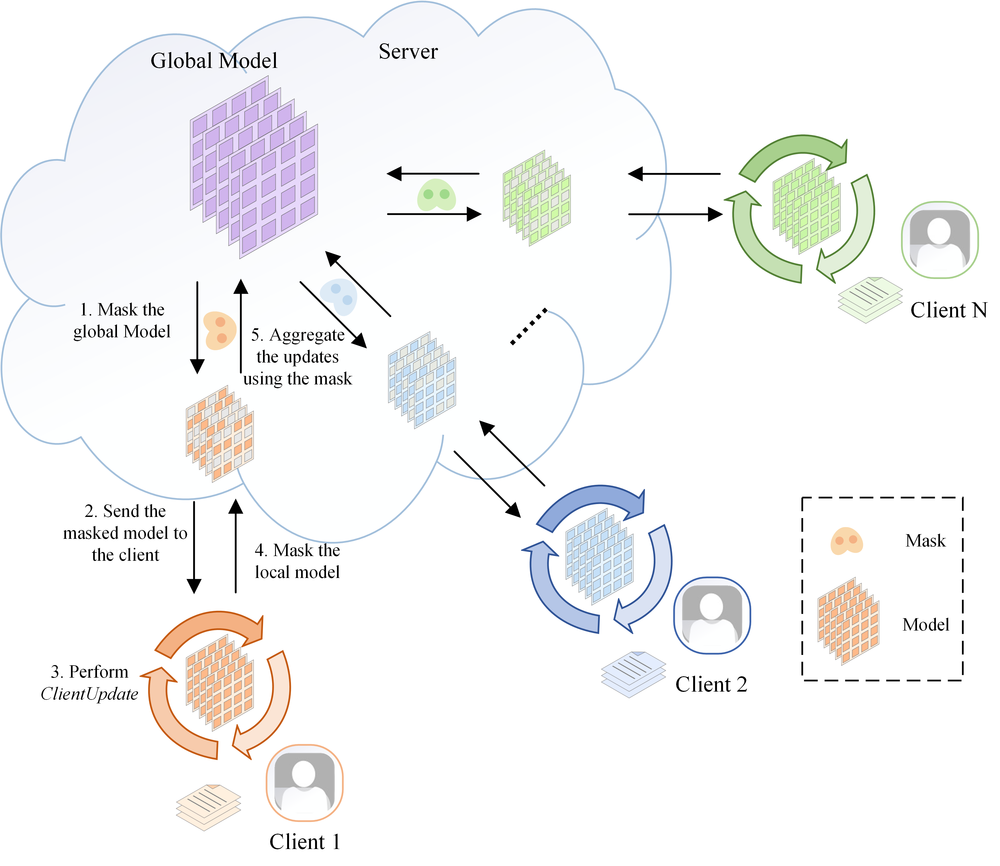

# FeadSeq: A Federated Unsupervised Anomaly Detection Framework for Discrete Event Sequences

This is the source code of our paper '**FeadSeq: A Federated Unsupervised Anomaly Detection Framework for Discrete Event Sequences**'.


## Requirements
- [PyTorch](https://pytorch.org)
- [NumPy](https://numpy.org)
- [scikit-learn](https://scikit-learn.org) = 1.0.2
- [pm4py](https://pm4py.fit.fraunhofer.de/)
- [pandas](https://pandas.pydata.org/) = 1.3.5
- [lxml](https://pypi.org/project/lxml/)

##Dataset Format
Logs are stored within  the folder '**_eventlogs_**'. Each file name follows the format: **log_name** _ **client_id** - **anomaly_ratio**.json.gz.

For instance, 'BPIC20_0-0.00.json.gz' denotes the clean log (i.e., anomaly_ratio=0) for client 0.


## Using Our Code
Execute the following command to initiate training and testing:
```
    python main.py --dataset BPIC20 --num_clients 5 --global_rounds 30 --sharing_rate 0.3
```
This command will train the model using the **BPIC20** dataset with an anomaly ratio of 0 for all five clients. The training process will run for 30 global rounds with a sharing rate of 0.3. 
Subsequently, the model will be tested on the **BPIC20** dataset with an anomaly ratio of 0.1 for all five clients. The test results will be saved in 'result.csv'. 
The results are obtained by calculating the average of the outcomes from the local datasets of all clients.